| 

  |  |  |
| -- | -- | -- |

# RAKwireless Audio library

## Introduction

RAKwireless Audio library is designed for RAK audio module and kit solutions. This library provides customer with abundant examples and solutions on audio field. User can use them for any scene 

- mono/stereo audio mode
- play music
- record voice
- voice recognition
- noise collector
- PDM and analog microphone
- DSPG module for audio data process

## Elements

As shown above, audio solutions includes below parts:

- RAK18003: Interposer Board, as a signal switch for wiscore, microphone, amplifier 
- RAK18030: [20-20kHz Microphone](https://rakwireless.atlassian.net/wiki/spaces/WISAUDIO/pages/142377158/RAK18030+-+20-20kHz+Microphone)                             
- RAK18031:[100-10kHz Microphone](https://rakwireless.atlassian.net/wiki/spaces/WISAUDIO/pages/142344614/RAK18031+-+100-10kHz+Microphone)                             
- [RAK18032: Ultrasonic Microphone](https://rakwireless.atlassian.net/wiki/spaces/WISAUDIO/pages/141329983/RAK18032+-+Ultrasonic+Microphone)
- [RAK18033: Stereo Mic Header Board](https://rakwireless.atlassian.net/wiki/spaces/WISAUDIO/pages/143097861/RAK18033+-+Stereo+Mic+Header+Board)                                   
- [RAK18040: Analog Mic to I2S](https://rakwireless.atlassian.net/wiki/spaces/WISAUDIO/pages/142901249/RAK18040+-+Analog+Mic+to+I2S)         
- [RAK18060: 5.6W Stereo Amplifier](https://rakwireless.atlassian.net/wiki/spaces/WISAUDIO/pages/142672154/RAK18060+-+5.6W+Stereo+Amplifier)           
- [RAK18061: 5.6W Amplifier](https://rakwireless.atlassian.net/wiki/spaces/WISAUDIO/pages/142606623/RAK18061+-+5.6W+Amplifier)                                                   
- RAK18080: DSPG board, audio process board

At the same time we will release some audio kit

- [WisBlock Microphone Interposer Kit](https://rakwireless.atlassian.net/wiki/spaces/WISAUDIO/pages/182419457/WisBlock+Microphone+Interposer+Kit)                                             
- [WisBlock Speaker Amplifier SD Kit](https://rakwireless.atlassian.net/wiki/spaces/WISAUDIO/pages/188645377/WisBlock+Speaker+Amplifier+SD+Kit)                    
- [WisBlock Remote Microphone Kit](https://rakwireless.atlassian.net/wiki/spaces/WISAUDIO/pages/188612616/WisBlock+Remote+Microphone+Kit)         
- [WisBlock Stereo Microphone Kit](https://rakwireless.atlassian.net/wiki/spaces/WISAUDIO/pages/188612609/WisBlock+Stereo+Microphone+Kit)                       
- [Amplifier Microphone & SD Kit](https://rakwireless.atlassian.net/wiki/spaces/WISAUDIO/pages/182223279)                    
- [WisBlock Voice Processing Kit](https://rakwireless.atlassian.net/wiki/spaces/WISAUDIO/pages/185892865/WisBlock+Voice+Processing+Kit)                    
- [WisBlock Voice Processing Speaker Kit](https://rakwireless.atlassian.net/wiki/spaces/WISAUDIO/pages/185925633/WisBlock+Voice+Processing+Speaker+Kit)                             
- WisBlock Audio Accessories               

All elements can be used separately or together. However, there are two points need to note:

- They all use IO connector
- We advise to use them together and be sure the microphone placed on the top of stack.

## Installation

#### BSP Update

Please update BSP part to the last version, which will support basic driver.

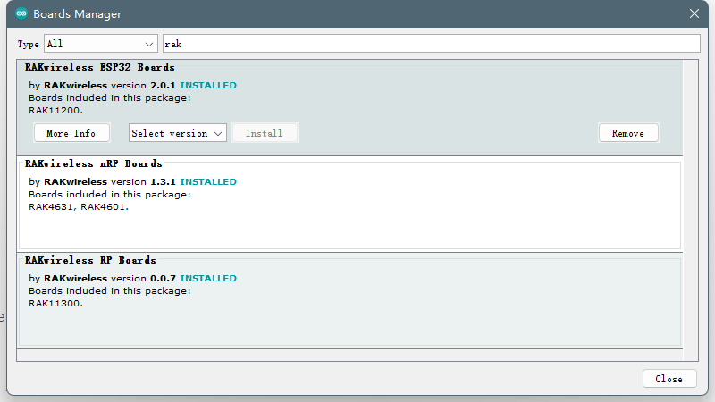

#### Rakwireless Audio library

Then install audio library, which contains other part of driver, like amplifier, DSPG. And includes all examples and solutions.

## Examples & Solutions

The examples can be separated 4 parts. The test code is just for test and can be ingnored.

- #### Audio Graph

  Audio graph will show the audio wave with rawdata from microphone, including analog or digital. We have supported several kinds of graph, here we will show the difference by two examples 

  - Original Data Graph

    Here we use RAK4631+RAK18030 to show the digital wave, and same as the analog.

    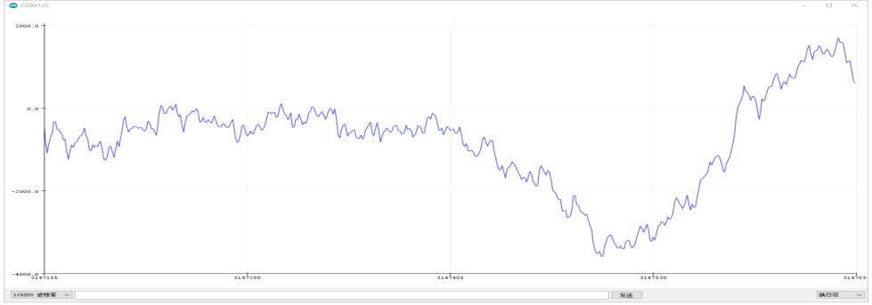

  - FFT Graph

    The "Fast Fourier Transform" (FFT) is an important measurement method in the science of audio and acoustics measurement. It converts a signal  into individual spectral components and thereby provides frequency  information about the signal. FFTs are used for fault analysis, quality  control, and condition monitoring of machines or systems. This article  explains how an FFT works, the relevant parameters and their effects on  the measurement result.

    Strictly speaking, the FFT is an optimized algorithm for the  implementation of the "Discrete Fourier Transformation" (DFT). A signal  is sampled over a period of time and divided into its frequency  components. These components are single sinusoidal oscillations at  distinct frequencies each with their own amplitude and phase. This  transformation is illustrated in the following diagram. Over the time  period measured, the signal contains 3 distinct dominant frequencies. 

  

  

  ​		Below is what we get with RAK4631+RAK18032, and of course you can use other wiscore and microphone.

  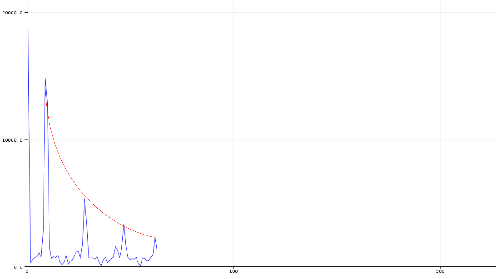

- #### Aduio Alarm

  We combine the wireless and audio alarm. When the audio rawdata value reach to a threshold, it will report a alarm by LoRaWAN, WIFI. Or you can just use the local alarm. You can modify the threshold in code.

  - With LoRa

    This example use RAK4631+RAK18003+RAK18030, and based on LoRaWAN OTAA. After join the network, the PDM will listen and report a alarm when triggered.

    ​                          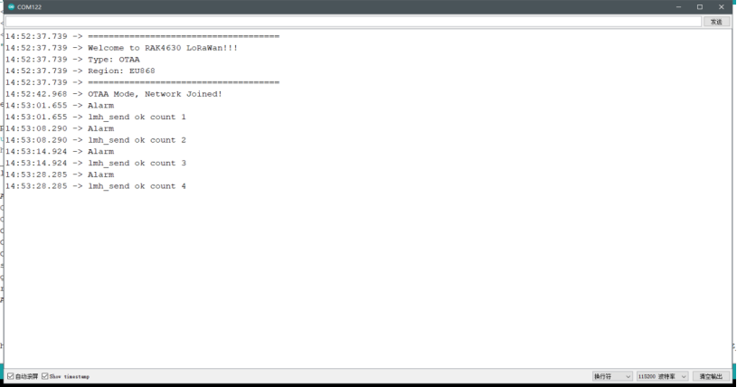  

    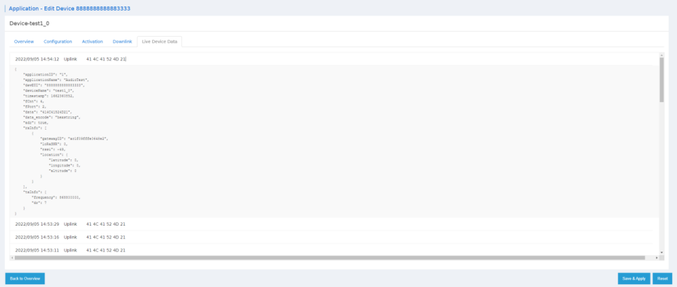

  - With WIFI

    This example use RAK11200+RAK18003+RAK18030, and based on WIFI. After connection, the PDM will listen and report a alarm to remote server with TCP when triggered.

    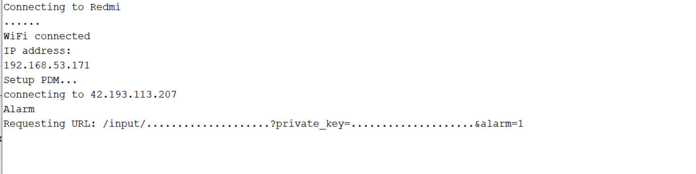

    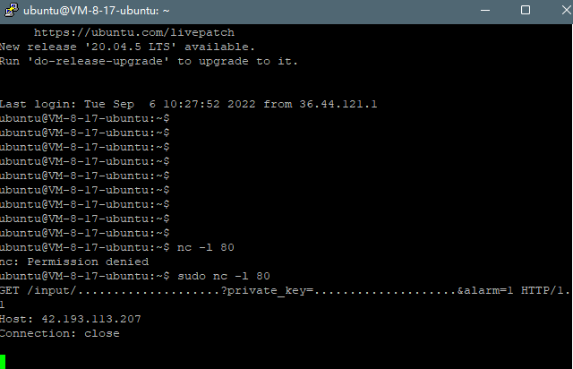

  - Local

    When use in local, it is just a alarm with a buzzer.

- #### Voice Recognition

  The Cyberon Software provides the ability of RAKwireless customers to enable voice control within their WisBlock System. The Cyberon software allows for the detection of specified voice triggers or commands. These commands are stored in a file which the customer links in when building their code.

  Cyberon provides a set of tools to create these models. When the software is provided to customers RAK will provide one (or more) “standard” models to be used by makers and for evaluation of commercial customers. Currently the Cyberon Software can run on two different “platforms” within the WisBlock Audio:

  1. The WisCore (RAK11200 (ESP), RAK11310 (RP2040), RAK4631 (nRF52840))
  2. The RAK18080 (DSPg DBM10L).

  

  We provide three standard mode now as below, first and second is for local device control and third is for LoRaWAN node.

  | Function       | Trigger         | Commands                                                     |
  | -------------- | --------------- | ------------------------------------------------------------ |
  | Music          | “Hey RAK Star”  | “Play Music”, “Stop Music”, “Previous Song”, “Next song”, “Volume Up”, “Volume Down”, “Stop”, “Pause”, “Next”, “Resume”, “Previous”, “Volume Up”, “Volume Down”, “Increase Volume”, “Decrease Volume” |
  | Light Contrrol | “Hey RAK Star”  | "Turn Lights on”, “Turn Lights off”, “Lights on”, “Lights off”, “Turn lights up”, “Turn lights down”, “Dim lights”, “Brighten lights”, “Lights Red”, “Lights Blue”, “Lights Green”, “Lights Yellow”, “Lights Orange”, “Lights Pink” |
  | WisDM          | “Hey RAK Cloud“ | “Connect”, “Disconnect”, “Report Location”, “Get Status”, “Report Battery“,“Report Environment”, “Reset” |

  

  - WisCore
    - WisDM
    
      This examples use RAK4631+RAK18003+RAK18030. When say "Connect", it will connect to the lora server, and of course, you need to make some configuration, like DEVEUI, APPEUI... If you want to use TTN, same as well.
    
      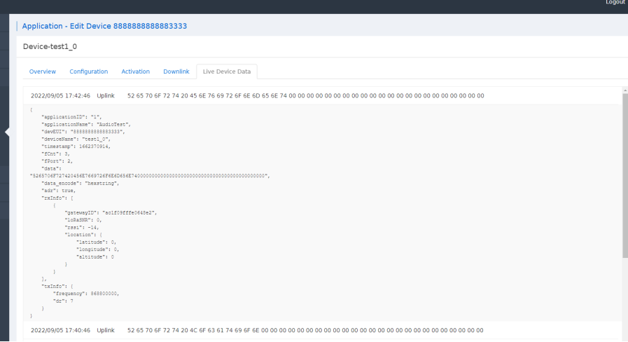
    
    - RGB
    
      This example use RAK19001+RAK4631+RAK18003+RAK14001+RAK18030. When say "Turn Lights on", the RGB will on. And you can test other commands, like  “Lights Pink”, it will be pink.
    
      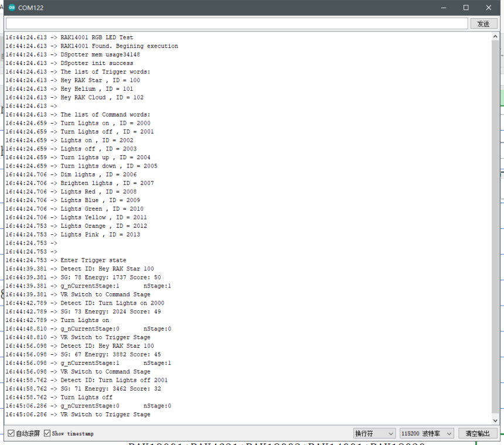
    
  - DSPG

    - Music
    
       This example use RAK18030/1/2+RAK18003+RAK18060+RAK18080+RAK11200.When say the trigger words wakes up the WisCore then say command words it will print the recognized command and ID number by  serial port.
       
       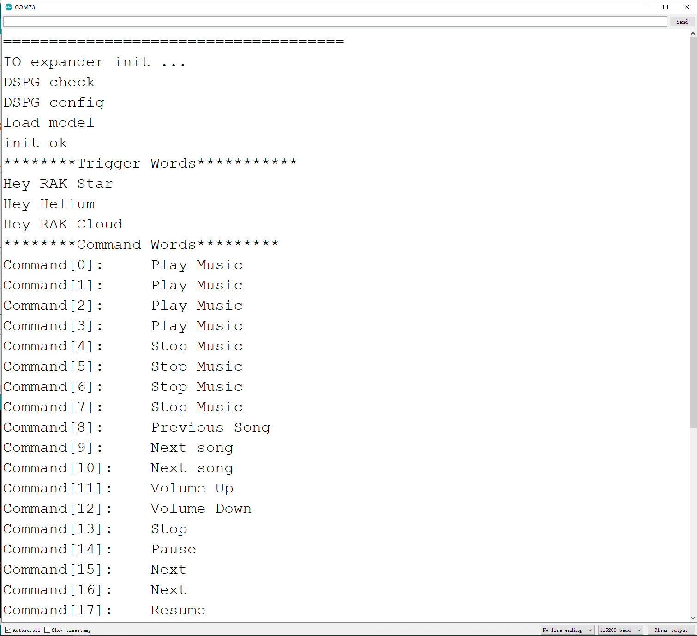
    
      

- #### Play & Record

  Because of the limitation of hardware, we only support record/play WAV file via SD card on RAK11200.   
  
  - Record to SD
  
  - note：This example need use the battery power for WisBase.
  
    This example use RAK11200+RAK18003+RAK18030+SD card. And you can modify the parameter, like frequence, channel or date bit.
  
    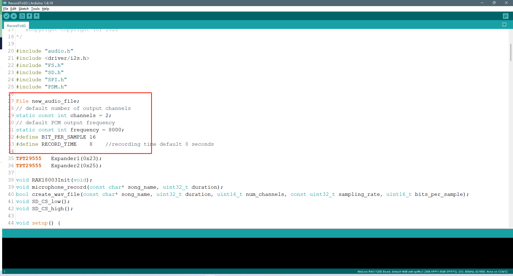
  
    Then you will find the record file in the SD card.
  
    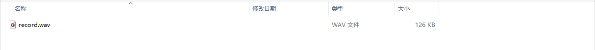
  
  - Play from SD
  
  This example use RAK11200+RAK18003+RAK18060+Speaker+SD card. And first store the WAV file in SD card and modify the name to "test".
  
  
  
  Then download the example and play. It can detect the different format of WAV in the SD card and play "test.wav".
  
  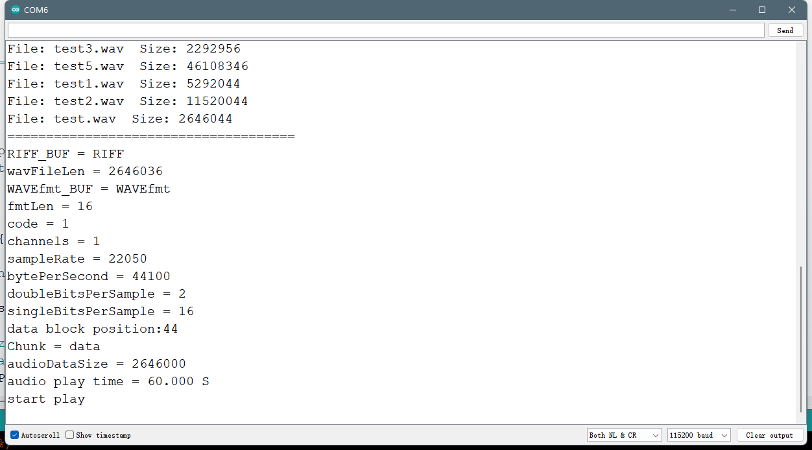
  
  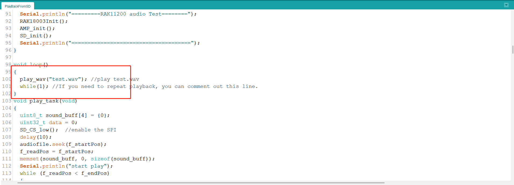

#### How to general header from

####  WAV

Please use the python in tool, and put your WAV at the same place, run **python .\WAVconvert.py**

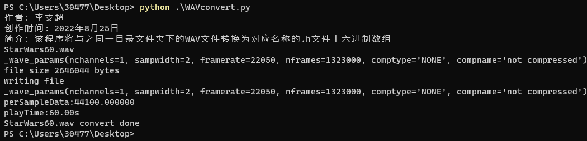

